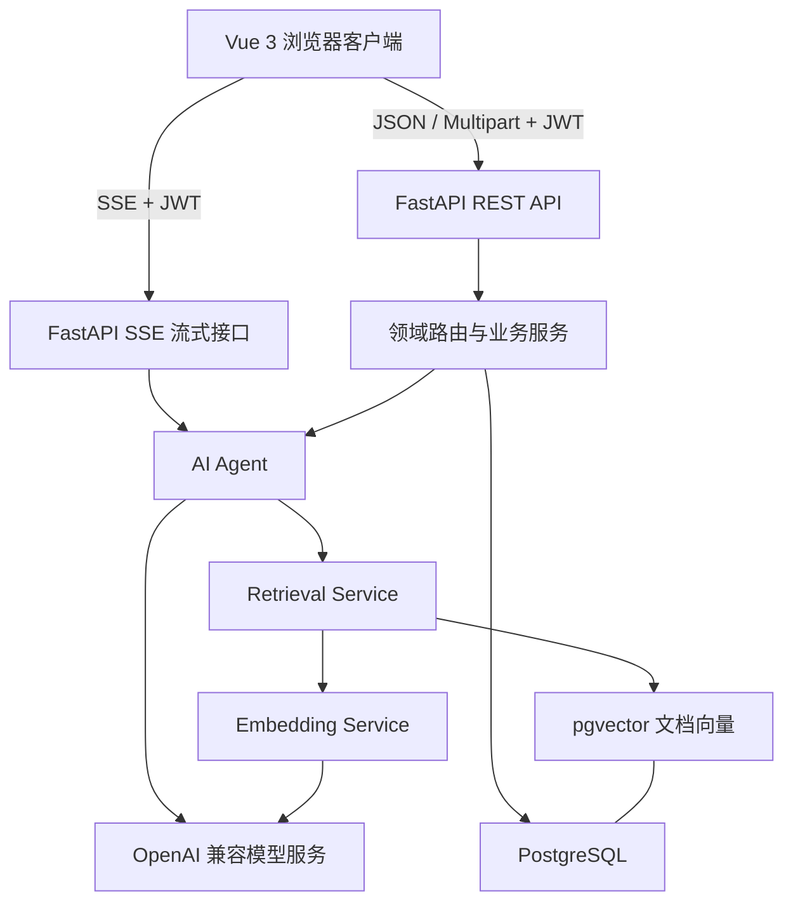
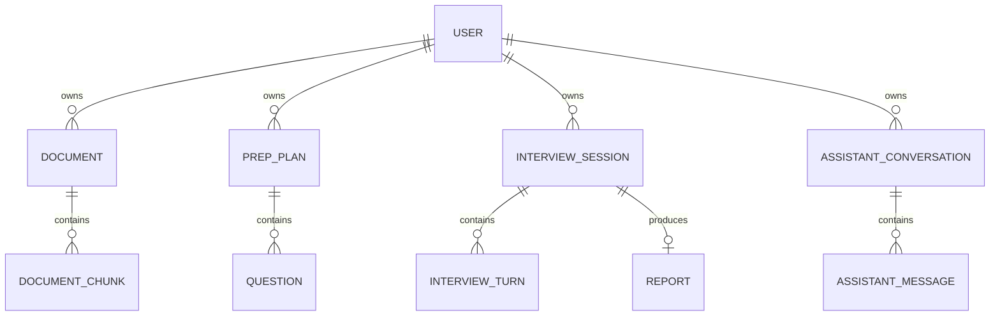

# InterviewPilot 开发与技术说明

> 本文档面向求职展示、技术面试和项目二次开发。内容以当前仓库实现为准，重点说明项目解决的问题、核心架构、AI 能力、前后端实现、数据模型、开发流程与工程化实践。文中将“现有实现”和“可演进方向”明确区分，避免把规划描述成已完成能力。

## 1. 项目定位

InterviewPilot 是一个基于 RAG（Retrieval-Augmented Generation，检索增强生成）的 AI 面试准备平台。用户可以上传简历和职位描述（JD），系统围绕真实材料生成准备计划、岗位匹配分析和面试题，并在模拟面试后给出结构化评分与复盘报告。

项目希望解决三个实际问题：

1. 通用大模型不了解候选人的真实经历，回答容易空泛或产生幻觉。
2. 普通题库无法针对具体岗位和个人背景生成问题。
3. 面试练习缺少可量化、可追踪的反馈闭环。

完整业务闭环如下：

```text
注册或游客登录
    ↓
上传简历和 JD
    ↓
文档解析、切片、Embedding、向量入库
    ↓
岗位匹配度、JD 关键词和准备路线图
    ↓
基于个人材料生成面试题
    ↓
模拟回答、AI 四维评分、动态追问
    ↓
生成复盘报告、趋势图和改进建议
    ↓
通过全局 AI 助手继续追问和复盘
```

## 2. 技术栈

### 2.1 后端

| 技术 | 用途 |
| --- | --- |
| Python 3.11 | 后端运行时和容器基础镜像 |
| FastAPI | REST API、依赖注入、参数校验和 OpenAPI 文档 |
| SQLAlchemy 2 | ORM、会话管理和查询构建 |
| Alembic | PostgreSQL 数据库迁移 |
| PostgreSQL 17 | 核心业务数据存储 |
| pgvector | 文档向量存储与 L2 距离检索 |
| Pydantic Settings | 环境变量和应用配置 |
| OpenAI Python SDK | 调用兼容 OpenAI 协议的聊天与 Embedding 服务 |
| python-jose | JWT 签发和校验 |
| pwdlib | Argon2 密码哈希及旧 bcrypt 哈希兼容 |
| structlog | 结构化日志 |
| pytest | 后端测试 |

### 2.2 前端

| 技术 | 用途 |
| --- | --- |
| Vue 3 | 页面和组件开发 |
| TypeScript | 静态类型约束 |
| Vite | 本地开发与生产构建 |
| Vue Router | 路由和登录守卫 |
| Pinia | 认证、助手、主题和 Toast 状态管理 |
| TanStack Vue Query | 服务端状态能力 |
| Tailwind CSS 4 | 样式系统 |
| Reka UI | 无障碍 UI 基础组件 |
| ECharts / vue-echarts | 雷达图和趋势图 |
| marked + DOMPurify | Markdown 渲染与 XSS 清理 |
| Vitest + Vue Test Utils | 组件和前端逻辑测试 |

### 2.3 工程化

| 技术 | 用途 |
| --- | --- |
| Docker Compose | 本地开发和生产服务编排 |
| Nginx | 生产环境前端静态资源与 API 反向代理 |
| GitHub Actions | 后端测试、Ruff 检查、前端测试和构建 |
| PowerShell | Docker 冒烟检查脚本 |

依赖的准确版本以 `backend/requirements.txt`、`frontend/package.json` 和锁文件为准，不在本文中重复维护容易过期的完整版本表。

## 3. 系统架构



系统采用前后端分离架构：

- 前端负责交互、状态管理、表单校验、SSE 增量消费和图表展示。
- FastAPI 路由负责鉴权、输入输出模型、资源归属校验和 HTTP 语义。
- Service 层负责文档解析、向量化、检索、AI 调用、匹配计算和会话上下文组装。
- PostgreSQL 保存用户、文档、计划、题库、面试、报告和助手会话。
- pgvector 保存 1024 维文档向量，并在用户数据范围内执行相似度检索。

## 4. 项目结构

```text
InterviewPilot-agent/
├── backend/
│   ├── alembic/                  # 数据库迁移环境与版本脚本
│   ├── app/
│   │   ├── core/                 # 配置、数据库、日志和安全基础设施
│   │   ├── models/               # SQLAlchemy 领域模型与向量模型
│   │   ├── routers/              # FastAPI API 与 SSE 路由
│   │   ├── services/             # AI、RAG、文档、匹配、助手和游客清理服务
│   │   ├── deps.py               # 鉴权和服务依赖注入
│   │   ├── schemas.py            # Pydantic 请求/响应模型
│   │   └── main.py               # 应用创建、中间件、生命周期和路由注册
│   ├── tests/                    # 后端测试
│   ├── Dockerfile
│   ├── requirements.txt
│   └── pyproject.toml
├── frontend/
│   ├── src/
│   │   ├── components/           # 业务组件、布局、图表和 UI 基础组件
│   │   ├── lib/                  # API 客户端、SSE 解析和通用工具
│   │   ├── pages/                # 路由页面
│   │   ├── stores/               # Pinia 状态
│   │   ├── router.ts             # 路由表与认证守卫
│   │   └── main.ts               # 前端入口
│   ├── Dockerfile
│   ├── nginx.conf
│   └── package.json
├── scripts/
│   └── docker-smoke.ps1          # Docker 服务冒烟验证
├── docs/                         # 设计、计划和开发文档
├── docker-compose.yml            # 基础数据库服务
├── docker-compose.override.yml   # 本地开发覆盖配置
├── docker-compose.prod.yml       # 生产覆盖配置
└── .github/workflows/ci.yml      # CI 流程
```

## 5. 核心业务流程

### 5.1 登录与游客体验

系统同时支持注册用户和游客用户：

- 注册/登录成功后返回 access token、refresh token 和用户信息。
- access token 默认有效期为 30 分钟，refresh token 默认有效期为 14 天。
- 前端把会话保存在 `localStorage`，请求时添加 `Authorization: Bearer <token>`。
- API 返回 401 时，前端尝试使用 refresh token 刷新会话并重放原请求。
- 游客可以在不注册的情况下体验完整流程，也可以转换为正式账户。
- 后端生命周期任务会定期清理过期游客及其关联数据；默认保留 24 小时、每 60 分钟检查一次。

密码策略使用 Argon2 生成新哈希，同时保留 bcrypt 验证器兼容历史账户。业务资源查询均结合当前用户 ID，防止跨用户访问。

### 5.2 文档处理

上传流程由 `routers/documents.py` 和 `services/documents.py` 协作完成：

1. 接收简历或 JD 文件，也支持直接粘贴 JD 文本。
2. 根据格式提取文本，支持 PDF、DOCX、PPTX 和纯文本。
3. PDF 常规提取结果不足时，可调用视觉模型执行 OCR 补偿。
4. 保存原始文本和基础摘要，初始向量状态为 `pending`。
5. 在后台任务中切片并调用 Embedding API。
6. 将切片和向量保存到 `document_chunks`，更新状态为 `ready`。
7. 失败时记录 `embedding_error` 并把状态设置为 `failed`。

向量状态包含：

| 状态 | 含义 |
| --- | --- |
| `pending` | 文档已保存，尚未开始向量化 |
| `processing` | 正在切片和调用 Embedding |
| `ready` | 向量已入库，可以执行 RAG 检索 |
| `failed` | 向量化失败，错误原因已记录 |

创建依赖 RAG 的准备计划前，后端会检查相关文档是否已经向量化完成，避免在数据未准备好时静默返回低质量结果。

### 5.3 RAG 检索

RAG 流程如下：

```text
用户问题或业务任务
    ↓
生成查询向量
    ↓
限定 user_id，必要时限定 document_id
    ↓
pgvector L2 distance 排序
    ↓
返回 Top-K 文档片段
    ↓
组装为模型上下文
    ↓
调用聊天模型生成结果
```

当前实现的关键参数：

- 默认切片大小：512 个字符。
- 默认重叠大小：64 个字符。
- 向量维度：1024。
- 默认召回数量：5 个片段。
- 检索方式：pgvector L2 distance。
- 查询缓存：进程内缓存，TTL 为 5 分钟。

切片器优先按照段落拆分；超长段落按照中英文句号、问号和感叹号拆分；单句仍然过长时再使用带重叠的强制切分。相比固定长度硬切，这种方式可以减少语义边界被破坏的问题。

检索始终带 `user_id` 条件。缓存键也包含用户 ID 和查询摘要，避免不同用户之间复用检索结果。需要注意，当前缓存是单进程内存缓存，多实例部署时各实例并不共享。

### 5.4 准备计划与岗位匹配

准备计划同时生成三个结果：

- 基于简历、JD 和目标岗位生成路线图。
- 从 JD 中提取结构化关键词。
- 基于简历与 JD 的向量相似度计算 Fit Score。

普通接口通过 `asyncio.gather` 并发执行三个子任务，减少串行模型调用带来的等待时间；流式接口则在每个子任务完成后立刻发送对应事件，最后保存准备计划并发送 `done` 事件。

当外部 AI 服务不可用时，后端会记录结构化日志，返回可识别的降级提示和基础路线图。降级结果会在 `roadmap._ai_notices` 中保留来源，前端可以明确告诉用户哪些内容不是完整 AI 生成结果。

### 5.5 题库、模拟面试和报告

- 题库生成会结合准备计划与 RAG 上下文生成分类、难度、问题和评分要点。
- 回答提交后，AI 从表达清晰度、结构化程度、证据充分度和复盘深度等维度生成反馈。
- 面试轮次保存问题、回答、反馈和得分，面试总分根据轮次结果更新。
- 动态追问通过 SSE 返回，使用户不需要等待完整响应后再看到内容。
- 报告基于面试轮次生成结构化复盘内容和指标，可用于雷达图、趋势图及历史对比。

### 5.6 全局 AI 助手

助手上下文会聚合当前用户的文档、活跃准备计划、题库数量、最近面试和最新报告。助手会话与消息持久化到数据库，刷新页面后仍能恢复。

流式对话过程：

1. 前端先把用户消息和空的助手消息加入 Pinia Store。
2. 使用当前 access token 请求 SSE 接口。
3. 每收到一个文本片段，就追加到当前助手消息。
4. 后端完成生成后将最终消息持久化。
5. 前端重新加载持久化会话，使本地状态与数据库一致。
6. 失败时把消息标记为 `error`，并显示简短的用户可见提示。

## 6. AI 应用开发设计

### 6.1 模型服务解耦

聊天模型和 Embedding 模型拥有独立配置：

- 聊天：`AI_BASE_URL`、`AI_API_KEY`、`AI_MODEL`。
- 轻量聊天任务：`AI_FAST_MODEL`，为空时回退到主模型。
- Embedding：`EMBEDDING_BASE_URL`、`EMBEDDING_API_KEY`、`EMBEDDING_MODEL`、`EMBEDDING_DIMENSIONS`。
- Embedding 地址或密钥为空时，回退到聊天模型服务配置。

这种设计允许项目使用不同供应商分别承担生成和向量化任务，也便于在成本、速度和质量之间进行选择。调用层使用 OpenAI Python SDK，因此服务端只要兼容相应 API 协议即可接入。

### 6.2 结构化输出

路线图、关键词、评分和报告等业务结果不是纯聊天文本，而是需要被数据库和前端稳定消费的结构化数据。AI Agent 负责：

- 构造系统指令、业务 Prompt 和检索上下文。
- 请求模型返回约定的 JSON 结构。
- 解析并规范化模型响应。
- 在解析或调用失败时返回受控降级结果。

业务路由仍会对结果做二次规范化，例如限制 Fit Score 范围、确保路线图字段为预期类型、去重 AI 降级提示。这样可以避免把模型当作完全可信的数据源。

### 6.3 AI 可用性与降级

项目区分“系统不可用”和“AI 能力暂时不可用”：

- 数据库或未处理异常会由全局异常处理器返回 500，并写入结构化日志。
- 单个 AI 子任务失败时，部分接口会保留基础业务结果，同时向前端暴露明确的降级通知。
- 本地没有配置 AI 密钥时，部分能力使用受控的模拟或兜底结果，以便进行前端联调。

求职介绍时应准确表述为“实现了 AI 调用失败的业务降级与提示”，不应描述为高可用集群或自动容灾系统。

## 7. 后端设计

### 7.1 分层职责

| 层 | 主要职责 |
| --- | --- |
| `core` | 配置、数据库引擎、日志和密码/JWT 基础能力 |
| `models` | ORM 实体、关系和向量字段 |
| `schemas.py` | 请求验证和响应序列化 |
| `deps.py` | 当前用户、数据库会话和检索服务依赖 |
| `routers` | HTTP/SSE 协议、资源归属检查和事务入口 |
| `services` | 可复用的领域逻辑、AI、文档与 RAG 能力 |

路由层不直接信任客户端传入的资源 ID。例如获取文档、计划、面试或报告时，除了按主键查询，还会验证记录的 `user_id` 是否属于当前用户。

### 7.2 配置加载

配置类位于 `backend/app/core/config.py`，按以下位置读取环境变量：

1. 项目根目录 `.env`。
2. `backend/.env`。
3. 进程环境变量。

Pydantic Settings 会忽略未识别字段。修改测试环境变量后需要清空 `get_settings()` 的缓存；测试夹具已经处理了该问题。

### 7.3 数据库会话

应用启动时创建 SQLAlchemy Engine 和 `SessionLocal`：

- PostgreSQL 使用连接健康预检 `pool_pre_ping=True`。
- 测试使用 SQLite 时自动添加 `check_same_thread=False`。
- `get_db()` 以 FastAPI 依赖形式提供会话，并在请求结束后关闭。
- 数据库结构由 Alembic 管理，应用启动不会调用 `create_all()` 代替迁移。

### 7.4 异常与日志

全局异常处理器捕获未处理异常，记录请求路径、HTTP 方法、错误信息和堆栈，对客户端统一返回：

```json
{
  "detail": "Internal server error"
}
```

预期的业务错误使用 `HTTPException` 返回清晰中文提示，例如“请先上传简历和 JD”或“准备计划不存在”。这样既避免向用户泄露内部堆栈，也方便前端统一展示。

### 7.5 SSE 流式传输

流式接口使用 `StreamingResponse`，媒体类型为 `text/event-stream`。通用 AI 流还包含：

- 每 15 秒发送一次 `:keepalive` 心跳。
- 多行文本按 SSE 规范拆成多条 `data:` 行，前端再用换行连接。
- 生成异常使用 `event: error` 通知客户端。
- 正常完成发送 `[DONE]` 或业务 `done` 事件。
- 生产 Nginx 对 `/api` 禁用代理缓冲，避免增量片段被聚合后一次性返回。

示例：

```text
event: message
data: 第一行
data: 第二行

event: done
data: [DONE]

```

## 8. 前端设计

### 8.1 路由结构

`frontend/src/router.ts` 使用嵌套路由构建应用框架：

| 路由 | 页面 |
| --- | --- |
| `/login` | 登录、注册和游客入口 |
| `/dashboard` | 总览、进度引导和计划入口 |
| `/documents` | 简历与 JD 管理 |
| `/questions` | 题库生成与浏览 |
| `/interview` | 模拟面试 |
| `/assistant` | AI 助手 |
| `/reports` | 报告与趋势 |
| `/plans/:id` | 准备计划详情 |
| `/settings` | 设置 |

认证守卫会把未登录用户重定向到 `/login`；已登录用户访问登录页时通常会回到仪表盘。

### 8.2 API 客户端

`frontend/src/lib/api.ts` 集中管理：

- API 基础地址。
- 请求和响应 TypeScript 类型。
- JSON 与 `FormData` 请求。
- Bearer Token 注入。
- 401 自动刷新和请求重试。
- FastAPI 校验错误格式化。
- 网络错误和 Toast 提示。
- SSE 数据块解析。

页面组件不重复实现鉴权和错误解析，降低了接口调用行为不一致的风险。

### 8.3 状态管理

| Store | 职责 |
| --- | --- |
| `auth` | Token、用户、游客状态和本地持久化 |
| `assistant` | 助手会话、流式消息、加载和错误状态 |
| `theme` | 深色、浅色和系统主题 |
| `toast` | 成功、错误、警告和信息通知 |

助手 Store 还记录当前已加载的用户 ID。用户切换后会清除旧会话状态，避免在同一浏览器中短暂展示前一个账户的内容。

### 8.4 用户可见错误

API 客户端将后端错误转换为简短提示：

- 无法连接后端：提示确认服务是否启动。
- FastAPI 字段校验：转换用户名、密码等字段名称。
- Token 过期：尝试刷新，失败后退出登录。
- SSE 失败：保留已收到内容并把消息标记为错误。

控制台错误不能替代用户提示；新增交互时应继续沿用 Toast 和页面级状态。

### 8.5 Markdown 安全

AI 输出先通过 Markdown 渲染，再通过 DOMPurify 清理生成的 HTML。新增 Markdown 扩展时需要继续确保未经清理的模型输出不会直接使用 `v-html` 渲染。

## 9. 数据模型



| 模型 | 关键内容 |
| --- | --- |
| `User` | 用户名、邮箱、名称、密码哈希、游客标识 |
| `Document` | 简历/JD、原始内容、摘要、分析、向量状态 |
| `DocumentChunk` | 文档片段、用户、序号和 1024 维向量 |
| `PrepPlan` | 目标岗位、Fit Score、路线图和文档引用 |
| `Question` | 分类、难度、问题和评分要点 |
| `InterviewSession` | 状态、总分和准备计划引用 |
| `InterviewTurn` | 单轮问题、回答、反馈和得分 |
| `Report` | 总分、正文和多维指标 |
| `AssistantConversation` | 助手会话范围、元数据和归档时间 |
| `AssistantMessage` | 角色、内容、状态和完成时间 |

用户关联的核心数据使用 `delete-orphan` 级联清理。删除文档时，其切片也会一并删除。生产数据库结构变更必须通过新 Alembic 迁移完成，不能直接修改已执行的历史迁移文件。

## 10. API 概览

所有业务接口默认以 `/api` 为前缀。除注册、登录、刷新和游客登录外，接口均需要 Bearer Token。完整请求/响应 Schema 以运行时 Swagger 为准：`http://localhost:8000/docs`。

### 10.1 认证

| 方法 | 路径 | 说明 |
| --- | --- | --- |
| POST | `/api/auth/register` | 注册账户 |
| POST | `/api/auth/login` | 登录 |
| POST | `/api/auth/refresh` | 刷新 Token |
| GET | `/api/auth/me` | 当前用户 |
| POST | `/api/auth/guest` | 创建游客账户 |
| POST | `/api/auth/convert-guest` | 游客转正式账户 |

### 10.2 文档

| 方法 | 路径 | 说明 |
| --- | --- | --- |
| POST | `/api/documents/resume` | 上传简历 |
| POST | `/api/documents/job-description` | 上传 JD 文件 |
| POST | `/api/documents/job-description-text` | 保存粘贴的 JD 文本 |
| GET | `/api/documents` | 获取当前用户文档 |
| POST | `/api/documents/{id}/analyze` | AI 简历诊断 |
| POST | `/api/documents/{id}/rewrite` | AI 简历重写建议 |
| DELETE | `/api/documents/{id}` | 删除文档及切片 |

### 10.3 计划、题库与面试

| 方法 | 路径 | 说明 |
| --- | --- | --- |
| POST | `/api/prep-plans` | 创建准备计划 |
| POST | `/api/prep-plans/stream` | 流式创建准备计划 |
| POST | `/api/prep-plans/jd-match` | JD 匹配差距分析 |
| GET | `/api/prep-plans` | 计划列表 |
| GET | `/api/prep-plans/{id}` | 计划详情 |
| POST | `/api/questions/generate` | 生成题库 |
| GET | `/api/questions` | 题库列表 |
| POST | `/api/questions/answer-cards` | 生成 STAR 回答卡 |
| POST | `/api/interviews` | 创建模拟面试 |
| POST | `/api/interviews/{id}/answer` | 提交回答并评分 |
| GET | `/api/interviews/{id}` | 面试详情 |
| GET | `/api/interviews/history/answers` | 历史回答对比 |

### 10.4 报告与助手

| 方法 | 路径 | 说明 |
| --- | --- | --- |
| POST | `/api/reports/{interview_id}` | 生成报告 |
| GET | `/api/reports` | 报告列表 |
| GET | `/api/reports/trend` | 报告趋势 |
| GET | `/api/reports/{report_id}` | 报告详情 |
| POST | `/api/assistant/context` | 获取助手上下文 |
| GET | `/api/assistant/conversation` | 获取活跃会话 |
| GET | `/api/assistant/messages` | 获取会话消息 |
| POST | `/api/assistant/chat` | 非流式助手对话 |
| DELETE | `/api/assistant/conversation` | 归档并清空活跃会话 |

### 10.5 流式接口

| 方法 | 路径 | 说明 |
| --- | --- | --- |
| GET | `/api/stream/assistant/chat` | 流式助手回答 |
| GET | `/api/stream/interviews/{id}/follow-up` | 流式生成追问 |
| GET | `/api/stream/reports/{interview_id}` | 流式生成报告文本 |

## 11. 环境变量

首先复制示例配置：

```powershell
Copy-Item .env.example .env
```

Linux/macOS：

```bash
cp .env.example .env
```

| 变量 | 用途 | 代码默认行为 |
| --- | --- | --- |
| `POSTGRES_USER` | Compose 数据库用户 | `interviewpilot` |
| `POSTGRES_PASSWORD` | Compose 数据库密码 | `interviewpilot` |
| `POSTGRES_DB` | Compose 数据库名 | `interviewpilot` |
| `DATABASE_URL` | SQLAlchemy 连接串 | 本机 PostgreSQL `interviewpilot` 数据库 |
| `JWT_SECRET` | JWT 签名密钥 | 仅适合开发的占位值 |
| `CORS_ORIGINS` | 明确允许的前端来源 | 本地 5173、5174 端口 |
| `CORS_ORIGIN_REGEX` | 本地开发端口正则 | 允许本机 5173～5179 |
| `AI_BASE_URL` | 聊天模型 API 地址 | 代码中提供兼容服务默认值 |
| `AI_API_KEY` | 聊天模型密钥 | 空 |
| `AI_MODEL` | 主聊天模型 | 由代码默认值或 `.env` 覆盖 |
| `AI_FAST_MODEL` | 轻量任务模型 | 空时使用主模型 |
| `EMBEDDING_BASE_URL` | Embedding API 地址 | 空时使用 `AI_BASE_URL` |
| `EMBEDDING_API_KEY` | Embedding 密钥 | 空时使用 `AI_API_KEY` |
| `EMBEDDING_MODEL` | Embedding 模型 | 由代码默认值或环境覆盖 |
| `EMBEDDING_DIMENSIONS` | 向量维度 | `1024`，必须与数据库字段一致 |
| `VITE_API_BASE_URL` | 前端 API 地址 | 未设置时使用 `/api` |
| `GUEST_RETENTION_HOURS` | 游客数据保留小时数 | `24` |
| `GUEST_CLEANUP_INTERVAL_MINUTES` | 游客清理周期 | `60` |

注意：`.env.example` 会覆盖部分代码默认值，因此实际运行配置应以当前 `.env` 为准。生产环境必须替换 `JWT_SECRET`、数据库密码和所有模型密钥，且不得把 `.env` 提交到仓库或输出到日志。

## 12. 本地开发

### 12.1 前置要求

- Python 3.11。
- Node.js 22 或与当前依赖兼容的更新 LTS 版本。
- npm。
- Docker Desktop（推荐用于 PostgreSQL + pgvector）。

### 12.2 启动数据库

项目根目录执行：

```powershell
docker compose up -d db
```

本地 Compose 会自动合并 `docker-compose.yml` 和 `docker-compose.override.yml`，因此数据库映射到本机 `5432` 端口。

### 12.3 启动后端

PowerShell：

```powershell
Set-Location backend
python -m venv .venv
.\.venv\Scripts\Activate.ps1
python -m pip install -r requirements.txt
alembic upgrade head
uvicorn app.main:app --reload
```

Linux/macOS：

```bash
cd backend
python -m venv .venv
source .venv/bin/activate
python -m pip install -r requirements.txt
alembic upgrade head
uvicorn app.main:app --reload
```

验证：

```powershell
Invoke-RestMethod http://localhost:8000/health
```

预期结果：

```json
{
  "status": "ok"
}
```

Swagger 地址：`http://localhost:8000/docs`。

### 12.4 启动前端

另开终端执行：

```powershell
Set-Location frontend
npm ci
npm run dev
```

访问 `http://localhost:5173`。Vite 会把 `/api` 代理到 `http://127.0.0.1:8000`。

根目录也提供快捷命令：

```powershell
npm run dev
npm test
npm run build
```

### 12.5 使用 Docker 启动完整开发环境

```powershell
docker compose up --build
```

本地覆盖文件会增加：

- `db`：PostgreSQL + pgvector，端口 5432。
- `backend`：自动执行迁移并以 reload 模式启动，端口 8000。
- `frontend`：Vite 开发服务器，端口 5173。

修改依赖清单或 Dockerfile 后应重新构建：

```powershell
docker compose up --build
```

## 13. 数据库迁移

启动后端之前必须将迁移执行到最新版本：

```powershell
Set-Location backend
alembic current
alembic upgrade head
```

修改 ORM 模型后的标准流程：

```powershell
alembic revision --autogenerate -m "添加面试状态字段"
alembic upgrade head
```

检查生成的迁移时重点确认：

- 新增、修改和删除的字段是否符合预期。
- PostgreSQL Enum 是否正确处理。
- 外键和索引是否完整。
- pgvector 维度是否与 `EMBEDDING_DIMENSIONS` 一致。
- 回滚函数是否可用。
- 是否意外删除已有表或数据。

不要编辑已经被其他环境执行过的迁移；应创建新的迁移修正结构。

## 14. 测试与质量检查

### 14.1 后端测试

```powershell
Set-Location backend
pytest -v
```

运行指定模块：

```powershell
pytest tests/test_stream_errors.py -v
pytest tests/test_migrations.py -v
```

后端测试在导入应用前强制设置独立 SQLite 数据库 `backend/test.db`，并拒绝在检测到非 SQLite 数据库时启动测试。这一保护避免本地 `.env` 中的 PostgreSQL 开发数据被测试清理或污染。

涉及 pgvector 或外部模型的单元测试通过 Mock、替代服务或独立迁移测试验证；提交前仍应在 PostgreSQL + pgvector 环境执行 Docker 冒烟检查。

### 14.2 前端测试和构建

```powershell
Set-Location frontend
npm test
npm run build
```

`npm run build` 同时执行 Vue/TypeScript 检查和 Vite 生产构建。只运行测试不能替代构建检查，因为未被测试覆盖的组件仍可能存在类型错误。

### 14.3 Docker 冒烟检查

完整服务启动后执行：

```powershell
.\scripts\docker-smoke.ps1
```

脚本验证：

- Compose 服务状态。
- 后端容器是否运行。
- PostgreSQL 是否 ready。
- Alembic 当前版本是否可查询。
- `/health` 是否返回 `ok`。

### 14.4 CI

GitHub Actions 在 `master` 分支的 push 和 pull request 上运行：

- Python 3.11 + PostgreSQL/pgvector 服务。
- 安装后端依赖并执行 `pytest -v`。
- 安装 Ruff 并执行 `ruff check .`。
- Node.js 22 + `npm ci`。
- 前端 `npm run build` 和 `npm test`。

## 15. 生产部署

生产构建使用基础 Compose 文件和生产覆盖文件：

```powershell
docker compose -f docker-compose.yml -f docker-compose.prod.yml up -d --build
```

生产结构：

- PostgreSQL 只在 Compose 网络内部提供服务。
- 后端容器启动前自动执行 `alembic upgrade head`。
- 前端使用多阶段 Docker 构建生成静态文件。
- Nginx 对外监听 80 端口，并把 `/api` 转发到后端容器。
- `/api` 关闭 `proxy_buffering`，保证 SSE 增量传输。

生产发布前检查：

```text
[ ] 后端测试通过
[ ] Ruff 检查通过
[ ] 前端测试和构建通过
[ ] 数据库迁移已经人工审查
[ ] JWT_SECRET 和数据库密码已经替换
[ ] AI 与 Embedding 密钥已通过安全方式配置
[ ] CORS 只允许真实前端域名
[ ] 数据库已经备份
[ ] 健康检查正常
[ ] 登录、上传、计划生成、面试和 SSE 完成冒烟测试
[ ] 已准备数据库与应用版本回滚方案
```

当前仓库提供容器化部署基础，但没有内置云平台、TLS、集中式日志、指标监控和自动数据库备份方案。这些属于部署环境需要补充的能力。

## 16. 常见问题排查

### 16.1 浏览器显示 CORS 错误

CORS 可能只是表象。优先检查后端终端和结构化日志是否出现 500；后端异常导致响应未按预期返回时，浏览器也可能表现为跨域失败。

然后检查：

- 前端实际来源是否包含在 `CORS_ORIGINS`。
- `VITE_API_BASE_URL` 是否指向正确后端。
- 后端是否已经启动。
- 代理或网关是否丢失响应头。

### 16.2 数据库连接失败

```powershell
docker compose ps
docker compose exec -T db pg_isready -U interviewpilot -d interviewpilot
```

同时确认：

- 本地开发连接地址使用 `localhost:5432`。
- Compose 后端连接地址使用服务名 `db:5432`。
- `.env` 中的用户名、密码和数据库名与 Compose 一致。

### 16.3 提示数据库表或字段不存在

```powershell
Set-Location backend
alembic current
alembic heads
alembic upgrade head
```

不要使用 `Base.metadata.create_all()` 绕过迁移问题。

### 16.4 文档一直不能用于 RAG

检查文档的 `embedding_status` 和 `embedding_error`，并确认：

- Embedding 地址和密钥有效。
- 模型支持 `dimensions=1024` 参数。
- 数据库 `document_chunks.embedding` 维度为 1024。
- 后端后台任务没有异常退出。

### 16.5 SSE 一次性返回而不是逐字显示

检查：

- Nginx `/api` 是否关闭 `proxy_buffering`。
- 中间 CDN 或网关是否缓存流式响应。
- 响应 `Content-Type` 是否为 `text/event-stream`。
- 前端是否在 `done` 事件之前就处理收到的数据块。
- 多行 SSE 是否按多个 `data:` 行编码。

### 16.6 测试误连开发数据库

当前 `backend/tests/conftest.py` 会强制测试使用 SQLite，并在检测到其他数据库时终止。如果自定义测试启动方式绕过了 `conftest.py`，必须先确认测试数据库隔离，不要直接清理 `.env` 指向的 PostgreSQL。

## 17. 安全设计与注意事项

已经实现的安全措施：

- Argon2 密码哈希，兼容旧 bcrypt 哈希。
- access token 和 refresh token 类型区分。
- 路由级用户资源归属验证。
- AI Markdown 输出经过 DOMPurify 清理。
- 全局异常响应不暴露服务端堆栈。
- 游客数据定时清理。
- 测试数据库强制隔离。

仍需根据生产环境补充：

- HTTPS 和安全响应头。
- Token 撤销、设备管理或服务端会话黑名单。
- 登录、注册、上传和 AI 接口限流。
- 文件大小、内容和恶意文件扫描策略。
- 密钥托管与定期轮换。
- 审计日志、监控告警和异常追踪。
- 数据库备份、恢复演练和数据保留策略。

当前 Token 存在 `localStorage`，实现简单但需要严格防范 XSS。更高安全要求下可以评估 HttpOnly Cookie、CSRF 防护和更完整的会话管理。

## 18. 新功能开发约定

新增后端功能时：

1. 先确认请求和响应 Schema。
2. 在 Router 中处理 HTTP 语义、依赖和资源归属。
3. 把可复用业务逻辑放入 Service。
4. 数据模型变化同步创建 Alembic 迁移。
5. 补充正常路径、权限、校验和异常测试。
6. 若前端可见，同步添加简短、可操作的错误提示。

新增前端功能时：

1. 优先复用现有 UI、布局、Toast 和 API 封装。
2. 在 `lib/api.ts` 增加准确的 TypeScript 类型和接口方法。
3. 页面只维护展示状态，共享状态放入合适的 Store。
4. 表单先做前端校验，同时保留后端最终校验。
5. 补充组件测试并执行生产构建。

新增 AI 能力时：

1. 明确输入上下文、输出 Schema 和最大数据范围。
2. 对模型输出做解析、类型检查和范围归一化。
3. 明确超时、失败、空响应和格式错误的降级行为。
4. 避免把用户之间的上下文、缓存或向量结果混用。
5. 使用 Mock 测试 Prompt 编排与解析逻辑，不让普通测试依赖真实模型费用和网络。

## 19. 求职展示要点

### 19.1 AI 应用开发方向

可以重点介绍：

- 自建文档处理、语义切片、Embedding、pgvector 检索和上下文注入的 RAG Pipeline。
- 聊天模型与 Embedding 模型分离配置，兼容不同模型供应商。
- 对路线图、关键词、评分和报告使用结构化输出，而不是只返回聊天文本。
- RAG 检索带用户隔离与短期缓存。
- AI 子任务并行执行、流式反馈和失败降级。

推荐表述：

> 设计并实现了面向简历和 JD 的 RAG Pipeline，通过语义切片、Embedding 和 pgvector L2 检索为题库生成、面试评分与助手问答提供个人上下文；对模型输出进行结构化解析、类型归一化和失败降级，避免直接信任模型响应。

### 19.2 Python 后端方向

可以重点介绍：

- FastAPI + SQLAlchemy 2 + Alembic 的分层后端。
- JWT access/refresh token、Argon2 密码哈希和游客账户转换。
- 资源级用户隔离、级联数据清理和后台游客清理任务。
- `asyncio.gather` 并发 AI 子任务和 SSE 心跳流式传输。
- 全局异常处理、结构化日志、测试数据库隔离和 CI。

推荐表述：

> 使用 FastAPI、SQLAlchemy 2 和 PostgreSQL 构建分层 API，完成 JWT 双 Token、用户级数据隔离、Alembic 迁移和结构化日志；通过 asyncio 并发执行独立 AI 子任务，并使用符合 SSE 规范的多行编码和心跳机制实现稳定流式响应。

### 19.3 全栈方向

可以重点介绍：

- Vue 3 + TypeScript + Pinia 前端和 FastAPI 后端的完整业务闭环。
- 集中式 API 客户端、Token 自动刷新、错误格式化和 Toast。
- SSE 增量解析、Markdown 安全渲染和会话持久化。
- ECharts 雷达图与趋势图。
- Docker 多阶段构建、Nginx 反向代理和 GitHub Actions CI。

推荐表述：

> 独立完成 Vue 3 与 FastAPI 全栈开发，前端实现统一 API 客户端、Token 自动刷新、SSE 增量渲染和可视化报告，后端实现认证、RAG、面试评分和数据持久化，并通过 Docker Compose、Nginx 与 GitHub Actions 建立开发、测试和部署流程。

## 20. 面试讲解建议

建议按以下顺序在 3～5 分钟内介绍项目：

1. **背景**：通用面试助手缺少个人经历和目标岗位上下文。
2. **方案**：上传简历/JD，构建 RAG 知识库，再驱动计划、题库、评分和助手。
3. **架构**：Vue 3 + FastAPI + PostgreSQL/pgvector + OpenAI 兼容模型。
4. **难点一**：文档切片、向量维度、用户隔离和检索质量。
5. **难点二**：模型输出不稳定，需要结构化解析和降级。
6. **难点三**：SSE 经过浏览器和 Nginx 后保持真实增量与换行。
7. **工程化**：迁移、测试隔离、CI、Docker 和错误提示。
8. **反思**：说明当前缓存、限流、监控和安全方面的边界及下一步方案。

面试官可能继续追问：

- 为什么使用 RAG，而不是微调？
- 为什么选择 L2 distance？是否评估过 cosine distance？
- 如何衡量召回质量和 AI 评分稳定性？
- Embedding 模型或维度变化时如何迁移历史向量？
- 如何防止用户读取其他用户的文档片段？
- SSE 为什么不使用 WebSocket？
- 多实例部署后内存缓存如何处理？
- 模型超时、限流或返回非法 JSON 怎么办？
- 为什么测试使用 SQLite，哪些 PostgreSQL 行为无法被覆盖？
- Token 放在 `localStorage` 有什么风险？

回答这些问题时应结合当前实现和限制，不要只给出概念性答案。

## 21. 当前边界与演进方向

以下为可演进方向，不代表当前已经实现：

1. 建立 RAG 离线评测集，量化 Recall@K、上下文相关性和答案忠实度。
2. 为 AI 评分引入固定样本、人工标注和多次运行一致性评估。
3. 将进程内 RAG 缓存迁移到 Redis，并完善失效策略。
4. 将文档向量化迁移到持久化任务队列，支持重试、进度和死信处理。
5. 增加接口限流、模型调用预算和用户配额。
6. 完善 OpenTelemetry、指标、错误追踪和告警。
7. 增加对象存储、文件安全扫描和更完整的数据生命周期管理。
8. 使用 PostgreSQL 集成测试补充 SQLite 无法覆盖的 Enum、向量和事务差异。
9. 建立 Embedding 模型升级和历史向量重建流程。
10. 补充生产级 TLS、密钥管理、备份恢复与自动回滚机制。

这些方向适合在面试中用于说明技术判断和系统演进能力，但应始终与已经落地的功能分开描述。

## 22. 文档维护原则

- 功能、环境变量、接口或部署方式变化时，同一变更中更新本文档。
- API 的精确字段以 Pydantic Schema 和 Swagger 为最终依据。
- 依赖版本以依赖清单和锁文件为最终依据。
- 数据库结构以 Alembic 迁移和 SQLAlchemy 模型共同为准。
- 不在文档中记录真实密钥、私有地址、用户数据或生产日志。
- 不写容易过期的测试用例数量，应记录验证范围和执行命令。
- 规划能力必须标注为“演进方向”，不能描述成当前成果。

